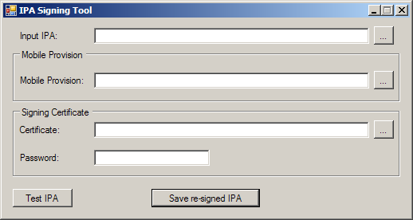

About IPASign:
==========================
This library and tool were designed to update the provisioning profile inside an IPA file and update the file signature.  
This tool is an alternative to Apple's codesign.  
This tool can be used on Windows, Linux and etc.

  

##### Q: Where is the provisioning profile stored?  
The provisioning profile is stored as 'embedded.mobileprovision' in the IPA file.  

##### Q: What is being signed?  
- The Mach-O executable (Identified by 'CFBundleExecutable' in Info.plist).  
- Info.plist  
- Code requirements expression.  
- Code entitlements plist.  
- The '_CodeSignature\CodeResource' file containing the file hashes (including 'embedded.mobileprovision').  

##### Q: Where is the signature stored?  
The CMS signature is stored as the last segment of the Mach-O executable (Identified by 'CFBundleExecutable' in Info.plist).  

Contact:
========
If you have any question, feel free to contact me.  
Tal Aloni <tal@kmrom.com>
